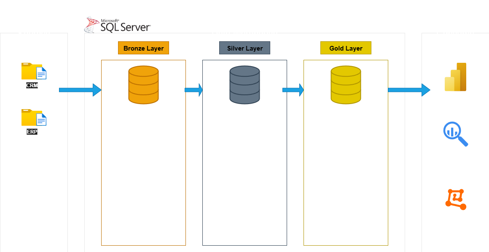

# Data Warehouse & Analytics Project

This is my **Data Warehouse & Analytics Project** – built from scratch, step by step.  
It’s not just a technical exercise, but also a project where I explored how raw data can be shaped, structured, and brought to life through careful design and clear analytics.  

---

## 🏗️ Data Architecture

The architecture follows the **Medallion Approach**: 


1. **Bronze Layer** – The raw landing zone: data ingested directly from CSV files into SQL Server.  
2. **Silver Layer** – Data is cleaned, standardized, and transformed into something consistent and reliable.  
3. **Gold Layer** – Business-ready data, modeled as a **star schema**, built for insights and decision-making.  

---

## 📖 Project Overview

This project includes:  

1. **Data Architecture** – A complete flow from raw ingestion to business-ready data  
2. **ETL Pipelines** – Processes to move and transform data efficiently  
3. **Data Modeling** – Fact and dimension tables supporting analytical queries  
4. **Analytics & Reporting** – SQL queries that reveal customer behavior, product performance, and sales trends  

At its core, the project shows how unstructured data can evolve into something meaningful when approached with the right architecture and discipline.  

---

## 🛠️ Tools & Technologies

- SQL Server Express  
- SQL Server Management Studio (SSMS)  
- Visual Studio Code (development & version control)  
- Draw.io for diagrams  
- GitHub for versioning  
- Notion for documenting steps and decisions  

---

## 📂 Repository Structure
```
SQL-Data-Warehouse-Project/
│
├── datasets/                # Optional raw source data (ERP, CRM)
│   ├── source_crm/
│   └── source_erp/
│
├── docs/                    # Documentation and standards
│   ├── catalog/             # Data catalog (fact/dimension descriptions)
│   │   └── data_catalog.md
│   ├── diagrams/            # Architecture, flows, integrations, models
│   │   ├── data_architecture.png
│   │   ├── data_flow.png
│   │   ├── data_integration.png
│   │   └── data_model.png
│   └── standards/           # Conventions and best practices
│       └── naming_conventions.md
│
├── scripts/                 # SQL scripts for ETL & transformations
│   ├── bronze/              # Raw ingestion layer
│   ├── silver/              # Cleaned & standardized layer
│   ├── gold/                # Star schema, business views
│   └── init_database.sql    # DB & schema initialization
│
├── analytics/               # Analytics and reporting
│   ├── scripts/
│   │   ├── eda/             # Exploratory Data Analysis (database, dimensions, measures, ranking, etc.)
│   │   ├── analysis/        # Deeper analysis (segmentation, cumulative, part-to-whole, etc.)
│   │   └── reports/         # Business reports (customers, products, KPIs)
│   └── README.md            # Analytics documentation
│
├── tests/                   # Data quality checks
│   ├── quality_checks_silver.sql
│   └── quality_checks_gold.sql
│
├── LICENSE
└── README.md                # Project overview
```
---

## 🛡️ License  

This project is licensed under the [MIT License](LICENSE).

---

## 🌟 About Me  

My name is **Panagiotis Christias**. I see data projects as a mix of logic and creativity – building pipelines and schemas is a bit like composing music: structure, flow, and harmony matter.  

This repository is one example of that approach: starting simple, layering complexity, and ending with something that feels complete.  

---

## 🔮 Future Work

This project is designed to keep evolving. Planned next steps include:

- **Tableau Visualizations**  
  Build interactive dashboards on top of the reporting views (`gold.report_customers`, `gold.report_products`) and publish them to **Tableau Public**, with screenshots and links added to the repository.

- **Python Extensions**  
  Add a `python/` folder with scripts and notebooks for:  
  - ETL automation (loading raw CSV data into SQL Server).  
  - Advanced analytics and exploratory data analysis with pandas.  
  - Optional data visualizations to complement the SQL reports.

These additions will extend the project from a SQL-only portfolio piece to a more **end-to-end data engineering workflow**.